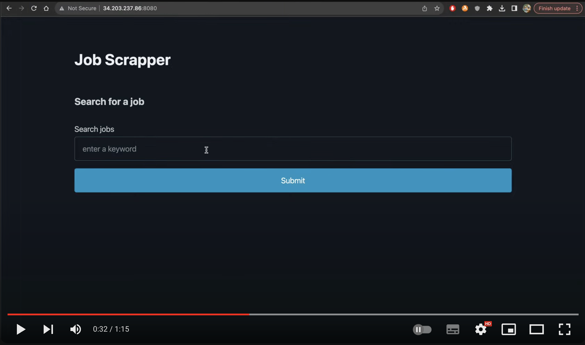

# Hansol Na
Personal Portfolio

# Projects
## [Toronto Housing Data Visualization Tool](http://54.160.156.101:8051/)	       
* Hosted a single-page app on AWS EC2 which collects housing data for 140 subdivided areas of Toronto to integrate with a geographical coordinate system to represent data in a visual form of a choropleth using pandas, and Dash plotly
* Implemented a Python script to scrape and extract housing data for Toronto, producing an extensive dataset for analysis

## [Python Job Scrapper](https://github.com/nahansol33/web_scrapper_project)
* Launched a development webserver using Flask via Python to host the application
* Developed a web-scraper that allows the user to search for jobs on websites “We Work Remotely” and “Indeed” simultaneously, saving all jobs found and their data into a downloadable csv file 
* Utilized Selenium, BeautifulSoup, and Requests libraries to scrape through job sites and gather data, becoming comfortable working with external libraries and documentations

## [Java Arcade Game: "John Wicked"](https://github.com/nahansol33/Project)
### *Team Leader*
* Created an arcade style shooting game that features: moving targets with varying patterns, scaling difficulty levels, and a scoreboard by applying Object Oriented Programming principles
* Implemented GUI using JavaFX to design a sign-in/sign-up page, File Handling system for data storage, Exception Handling to ensure code runs smoothly, and Object Oriented Programming concepts to create the codebase

## [Group Project: Java Card Game](https://github.com/nahansol33/SYST17796-GroupProject.git)
### *Team Leader*
*	Led a team of four to create our own card game, and drafted a comprehensive project proposal to establish project goals, programming requirements, and guidelines to be followed
*	Created UML (Unified Modelling Langaugge) Diagram and Use-Case Diagrams to delegate coding tasks for each group members and ensured successful completion of all parts
*	Used Java to develop our game and implemented Object Oriented Programming concepts to achieve high cohesion, loose coupling, and make our code more efficient

